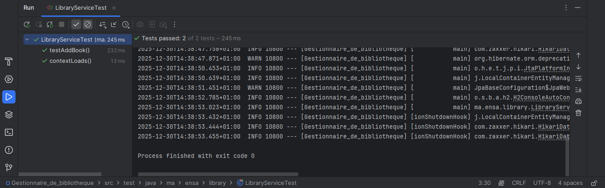
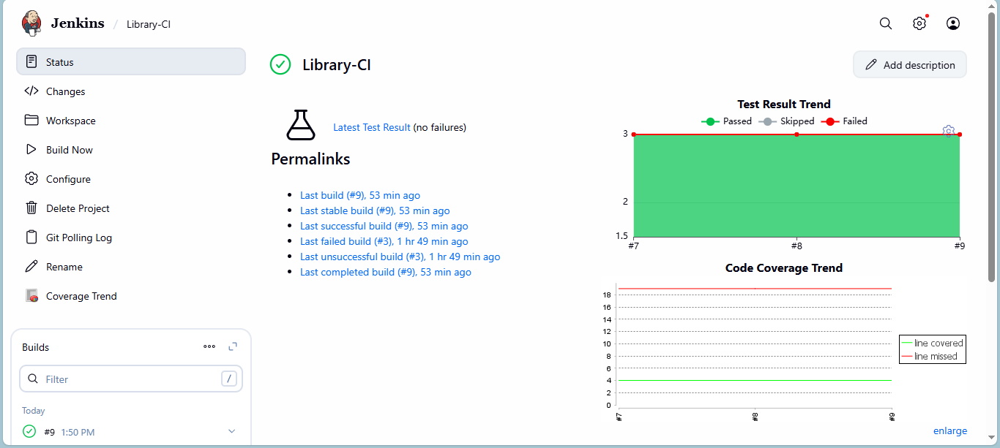

# 📚 Gestionnaire de Bibliothèque - Rapport de Projet CI/CD

Ce dépôt contient le code source et la configuration d'Intégration Continue (CI) pour une application de gestion de bibliothèque basée sur **Spring Boot**.

L'objectif de ce projet était de mettre en place une "usine logicielle" automatisée capable de tester et valider le code à chaque modification.

---

## 🛠️ Stack Technique
* **Langage :** Java 17
* **Framework :** Spring Boot 3.4.0
* **Base de données :** H2 (In-memory database)
* **Tests Unitaires :** JUnit 5 & Mockito (Isolation des tests)
* **Serveur CI :** Jenkins
* **Analyse Qualité :** JaCoCo (Java Code Coverage)

---

## 1️⃣ Phase 1 : Développement et Tests Unitaires
Avant l'automatisation, nous avons sécurisé le code avec des tests unitaires.
J'ai utilisé **Mockito** pour simuler la base de données (`BookRepository`). Cela permet de tester la logique métier (`LibraryService`) sans avoir besoin d'une connexion réelle à la base de données, rendant les tests ultra-rapides.


> *Preuve de fonctionnement des tests Mockito en local.*

---

## 2️⃣ Phase 2 : Première approche (Projet Jenkins Freestyle)
Dans un premier temps, j'ai configuré un projet de type **"Freestyle"** dans Jenkins (`Library-CI`).
* **Configuration :** Manuelle via l'interface graphique.
* **Déclencheur :** "Poll SCM" (Vérification toutes les minutes : `* * * * *`).
* **Commande :** `mvn clean package`.

Cette étape a permis de valider la connexion entre Jenkins et GitHub et de résoudre les problèmes d'encodage (UTF-8) rencontrés lors des premiers builds.


> *Historique des builds du projet Freestyle.*

---

## 3️⃣ Phase 3 : L'Industrialisation (Pipeline as Code)
Pour répondre aux standards professionnels, j'ai migré le projet vers un **Pipeline Jenkins**.
La configuration du build n'est plus cliquée dans l'interface, mais écrite dans un fichier **`Jenkinsfile`** versionné avec le code.

### Le fichier Jenkinsfile
Voici le script Groovy utilisé pour orchestrer le build :

```groovy
pipeline {
    agent any
    triggers {
        pollSCM '* * * * *' 
    }

    stages {
        stage('Checkout') {
            steps {
                checkout scm
            }
        }
        
        stage('Build & Test') {
            steps {
                bat 'mvn clean package'
            }
        }
    }

    post {
        always {
            junit '**/target/surefire-reports/*.xml'
            jacoco()
        }
    }
}
